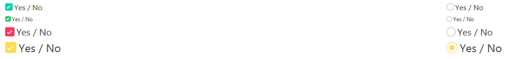

# bulma-checkradio
Bulma's extension to display better checkbox and radio imputs (find all my bulma's extensions [here](https://github.com/Wikiki/bulma-extensions))



Usage
---

```html
<div class="field">
  <input class="is-checkbox" id="exampleCheckbox" type="checkbox" name="exampleCheckbox">
  <label for="exampleCheckbox">Check me</label>
</div>

<div class="field">
  <input class="is-radio" id="exampleRadio" type="radio" name="exampleRadio">
  <label for="exampleRadio">I'm radio</label>
</div>
<div class="field">
  <input class="is-radio" id="exampleRadio2" type="radio" name="exampleRadio">
  <label for="exampleRadio2">I'm radio 2</label>
</div>
```

Modifiers
---
This extension uses Bulma's color & size modifiers

Variables
---
Name | Default value    
-----|---------------
$checkbox-radius | $radius
$checkbox-border | .1em solid $grey-light
$checkbox-disabled-color | $grey-lighter
$checkbox-disabled-checked-color | $grey-lighter

Demo
---
You can find a demo [here](https://codepen.io/wikiki/pen/qXYVyL)

Integration
---
- Clone the [bulma repo](https://github.com/jgthms/bulma)
- Under the `sass` folder, create a new folder called `extensions`
- In this new folder, create a new file `checkradio.sass`
- Copy the code form the `bulma-timeline repo`'s [checkradio.sass](https://github.com/Wikiki/bulma-checkradio/blob/master/checkradio.sass) file into your new file
- In the same folder create a new file `_all.sass` (this is not required, but will help when you add more extensions)
- In this file add this code:
```
@charset "utf-8"
@import "checkradio.sass"
```
At the end of the `bulma.sass` file, add this line: `@import "sass/extensions/_all"`

Now, you can just build the bulma project with `npm run build`, and the output will be available in the `css folder`.
